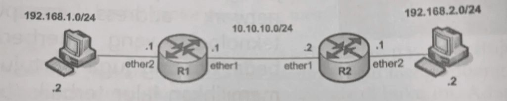
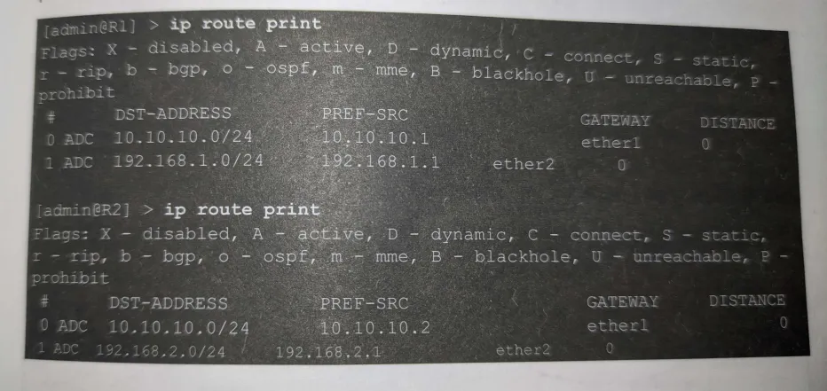
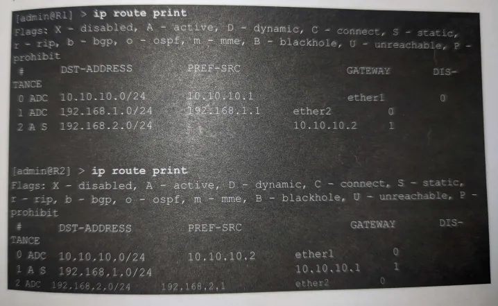

+++
title = 'Routing Static'
date = 2024-03-24T21:38:48+07:00
draft = false
+++

# Routing

Routing merupakan teknik yang digunakan untuk menghubungkan beberapa jaringan yang memiliki network address maupun teknologi yang berbeda-beda.

## Konsep Static Routing
Sebelum mengkonfigurasikan routing statik, maka saya ingin menjelaskan sedikit tentang konsep routing statik. Ini dimaksudkan supaya Anda tidak kebingungan mana kala akan mengkonfigurasikan routing statik pada topologi jaringan berbeda

Untuk memudahkan pemahaman tentang konsep routing statik, saya menggunakan topologi sederhana yang menggunakan dua router seperti terlihat pada gambar berikut



Sebagai langkah awal, konfigurasikanlah IP Address pada setiap interface yang ada pada Router R1 dan R2

Untuk melakukan teknik routing, Anda harus dapat membaca tabel routing. Tabel routing itu sendiri adalah tabel yang digunakan router sebagai pedoman untuk menuju suatu jaringan (network). Tabel ini dapat dianalogikan seperti peta yang akan digunakan oleh router. Router tidak akan dapat mengangkau suatu jaringan jika network address dari jaringan tersebut tidak ada dalam tabel routing. Tentunya, Anda akan kesulitan mencari suati lokasi jika lokasi tersebut tidak ada dalam peta



Jika Anda perhatikan dengan seksama, tabel routing pada R1 tidak berisi informasi tentang network 192.168.2.0/24. Begitu juga dengan R2 yang tidak berisi informasi tentang 192.168.1.0/24. Ini mengakibatkan komputer 192.168.1.2 tidak dapat berhubungan dengan omputer 192.168.2.2

Prinsip yang Anda gunakan dalam menerapkan routing statik adalah "**_Mau ke mana?_**" dan "**_Lewat mana?_**". Sebagai langkah pertama, marilah kita jadikan R1 sebagian acuan terlebih dahulu. Jika melihat topologi, jika R1 ingin menuju network 192.168.2.0/24, maka R1 harus melewati 10.10.10.2 yang merupakan interface _ether1_ dari R2. Dengan kata lain, 10.10.10.2 akan menjadi gatway bagi Router R1 jika ingin menuju network 192.168.2.0/24

Bagaimana dengan R2? Jika R2 ingin menuju network 192.168.1.0/24 maka R2 harus melewati 10.10.10.1 yang merupakan interface _ether1_ dari R1. Router R2 harus menggunakan 10.10.10.1 sebagai gateway untuk menuju network 192.168.1.0/24

Setelah memahami dengan benar konsep "**_Mau ke mana?_**" dan "**_Lewat mana?_**", maka tibalah saatnya Anda memberikan perintah-perintah konfigurasi routing statik baik pada R1 dan R2

Adapun perintah yang dapat Anda gunakan pada R1, agar R1 mengenal network 192.168.2.0/24
```shell
[admin@R1] > ip route add dst-address=192.168.2.0/24 gateway 10.10.10.2
```

Sedangkan untuk R2, perintah yang dapat Anda gunakan adalah sebagai berikut
```shell
[admin@R2] > ip route add dst-address=192.168.1.0/24 gateway 10.10.10.1
```

Setelah konfigurasi routing statik selesai Anda lakukan, maka periksalah kembali tabel routing pada masing-masing router. Seharusnya tabel routing pada masing-masing router terlihat seperti berikut



Anda dapat melihat tabel routing pada R1 telah lengkap, akrena telah berisi informasi network 192.168.2.0/24 dengan gateway 10.10.10.2. Begitu juga dengan tabel routing R2 yang telah memuat informasi network 192.168.1.0/24 dengan gateway 10.10.10.1. Jika tabel routing ini sudah lengkap, maka seharusnya komputer 192.168.1.2 sudah dapat berhubungan dengan komputer 192.168.2.2, demikian pula sebaliknya

Pada saat Anda melakukan konfigurasi IP Address pada komputer 192.168.1.2, jangan lupa untuk mengkonfigurasikan 192.168.1.1 sebagai default gateway. Begitu juga dengan komputer 192.168.2.2, Anda harus mengkonifurasikan 192.168.2.1 sebagai default gateway bagi komputer tersebut.


Makasih :D

## Source = Mikrotik Kung Fu Kitab 2 by Rendra Towidjojo
