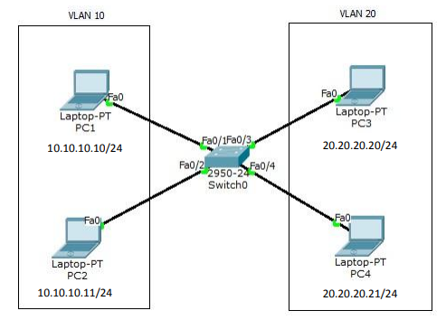

+++
title = 'VLAN'
date = 2024-03-24T23:15:26+07:00
draft = false
+++

# Virtual LAN (VLAN)

Virtual LAN (VLAN) adalah teknologi yang memungkinkan Anda untuk membagi satu broadcast domain menjadi beberapa broadcast domain, sehingga dalam satu switch bisa saja terdiri dari beberapa network. Host yang berbeda VLAN tidak akan tersambung sehingga meningkatkan security
jaringan.

VLAN adalah fasilitas yang dimiliki oleh switch manageable, contohnya cisco. Pada
switch unmanageable, port-port nya hanya dapat digunakan untuk koneksi ke
network yang sama (satu network) sehingga tidak mendukung fasilitas VLAN.

Buatlah topologi seperti pada gambar dibawah pada packet tracer. Konfigurasi VLAN
pada switch dengan VLAN10 berikan nama Marketing dan VLAN20 dengan nama
Sales. 



```console
Switch>enable
Switch#conf t
Switch(config)#vlan 10
Switch(config-vlan)#name Marketing
Switch(config-vlan)#vlan 20
Switch(config-vlan)#name Sales
Switch(config-vlan)#int f0/1
Switch(config-if)#switchport access vlan 10
Switch(config-if)#int f0/2
Switch(config-if)#switchport access vlan 10
Switch(config-if)#int f0/3
Switch(config-if)#switchport access vlan 20
Switch(config-if)#int f0/4
Switch(config-if)#switchport access vlan 20
```

Untuk pengecekan,ping dari satu PC ke PC lain dan ketikkan perintah show vlan
pada switch. PC tidak bisa ping ke beda VLAN.

```console
PC>ping 10.10.10.11
Pinging 10.10.10.11 with 32 bytes of data:
Reply from 10.10.10.11: bytes=32 time=0ms TTL=128
Reply from 10.10.10.11: bytes=32 time=0ms TTL=128
Reply from 10.10.10.11: bytes=32 time=0ms TTL=128
Reply from 10.10.10.11: bytes=32 time=0ms TTL=128
Ping statistics for 10.10.10.11:
Packets: Sent = 4, Received = 4, Lost = 0 (0% loss),
Approximate round trip times in milli-seconds:
Minimum = 0ms, Maximum = 0ms, Average = 0ms
PC>ping 20.20.20.21
Pinging 20.20.20.21 with 32 bytes of data:
Request timed out.
Request timed out.
Request timed out.
Request timed out.
Ping statistics for 20.20.20.21:
Packets: Sent = 4, Received = 0, Lost = 4 (100% loss),
PC>
```

```console
Switch#show vlan
VLAN Name                               Status             Ports
---- -------------------------------- --------- ----------------------------
---
1    default                            active   Fa0/5, Fa0/6, Fa0/7, Fa0/8
                                                 Fa0/9, Fa0/10, Fa0/11,
                                                 Fa0/12, Fa0/13, Fa0/14, 
                                                 Fa0/15, Fa0/16, Fa0/17, 
                                                 Fa0/18, Fa0/19, Fa0/20, 
                                                 Fa0/21, Fa0/22, Fa0/23,
                                                 Fa0/24
10   VLAN0010                           active   Fa0/1, Fa0/2
20   VLAN0020                           active   Fa0/3, Fa0/4
1002 fddi-default                       act/unsup
1003 token-ring-default                 act/unsup
1004 fddinet-default                    act/unsup
1005 trnet-default                      act/unsup
```

Makasih :D

## Source = Modul Mas Taufik by Muhammad Taufik